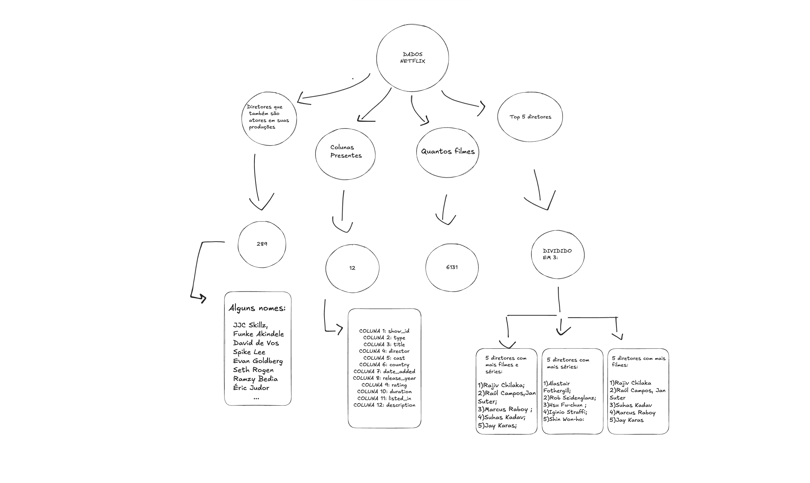
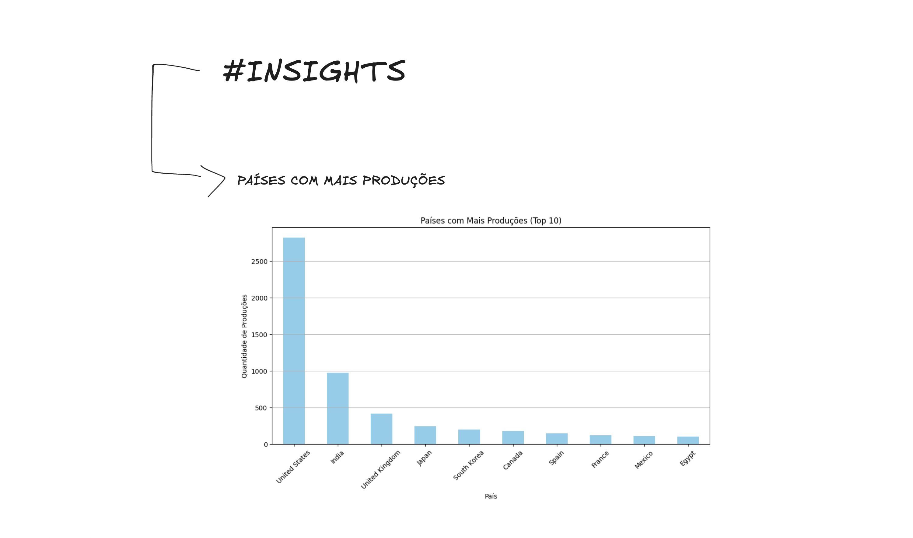
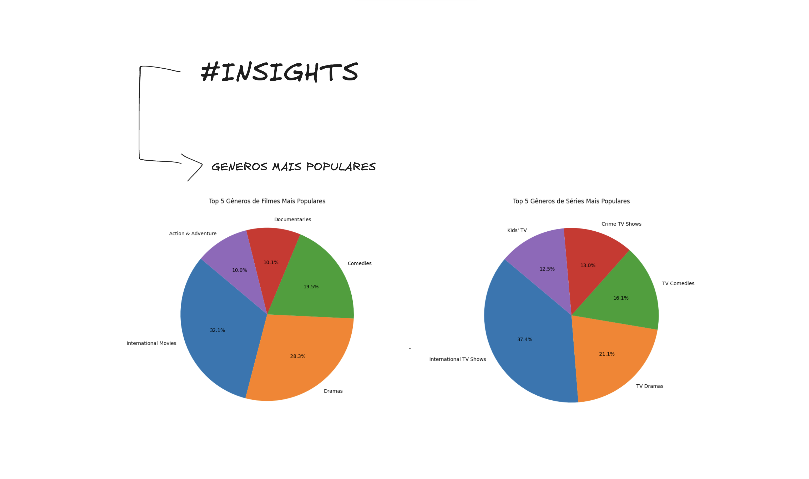
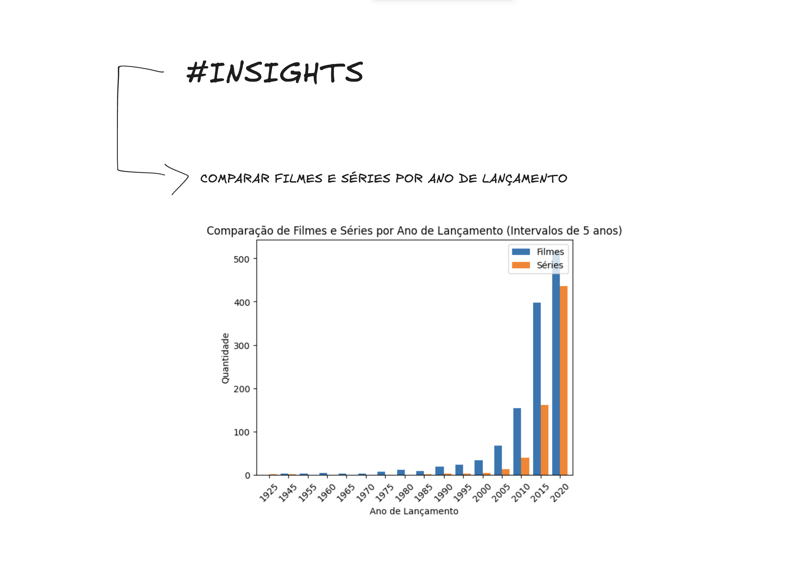

# Projeto de Análise de Catálogo Netflix 🎥

Este projeto realiza uma análise detalhada do catálogo de títulos da Netflix, focando em explorar padrões e tendências nos dados. Utilizando Python e bibliotecas como ***pandas*** e ***matplotlib***, foram desenvolvidos scripts que investigam a distribuição de produções por país, popularidade de gêneros, análise de diretores mais produtivos e comparações entre filmes e séries. O objetivo é extrair insights valiosos para entender melhor o perfil do conteúdo oferecido pela plataforma, utilizando visualizações e estatísticas para tornar os resultados mais intuitivos e impactantes

## Sumário


- [Resultados Esperados!!!!!](#resultados-esperados)
- [Requisitos](#requisitos)
- [Instalação](#instalação)
- [Configuração](#configuração)
- [Contribuição](#contribuição)

## Resultados Esperados

O projeto fornecerá:

- **RESPOSTAS:**  

- **INSIGHTS:**
  
    
    

## Requisitos

- Python 3.7 ou superior
- Bibliotecas Python:
  - `pandas`
  - `numpy`
  - `matplotlib`
  - `python-dotenv`
 

## Instalação

1. **Clone o repositório ou copie os arquivos para um diretório local**.

2. **Crie um ambiente virtual** (opcional, mas recomendado):

   ```bash
   python -m venv venv
   ```

3. **Ative o ambiente virtual**:

   - No Windows:

     ```bash
     venv\Scripts\activate
     ```

   - No Linux/Mac:

     ```bash
     source venv/bin/activate
     ```

4. **Instale as dependências**:

   ```bash
   pip install pandas numpy matplotlib python-dotenv 
   ```

   **Ou utilize o arquivo `requirements.txt`** (se disponível):

   ```bash
   pip install -r requirements.txt
   ```

## Configuração

1. **Obtenha o caminho do CSV**:
    [LINK PARA O CSV](https://www.google.com/url?q=http://eae.vexpens.es/files/deyin3ta4ffi7nta9xgsd7ksro/public?h%3D_kZmnFJZq56nRrPuHNcLXK0eLpl_US5ELfDw8sx69zM&sa=D&source=apps-viewer-frontend&ust=1728312999579257&usg=AOvVaw1TXE6tJn1acQExT9Mo_LBb&hl=pt-BR)
  . O projeto requer o caminho exato do arquivo de dados (netflix_titles.csv) para executar as análises. Certifique-se de que o arquivo esteja na pasta correta e com o nome especificado

2. **Crie um arquivo `.env`** na raiz do projeto e adicione o seu caminho:

   ```
   DATA_PATH=seu_caminho_para_o_arquivo/netflix_titles.csv
   ```

   Substitua `seu_caminho_para_o_arquivo` pelo seu caminho real.

3. **Adicione o arquivo `.env` ao seu `.gitignore`** (se aplicável):

   ```
   # .gitignore
   .env
   ```


## Contribuição

Contribuições são bem-vindas! Sinta-se à vontade para abrir issues ou enviar pull requests.

